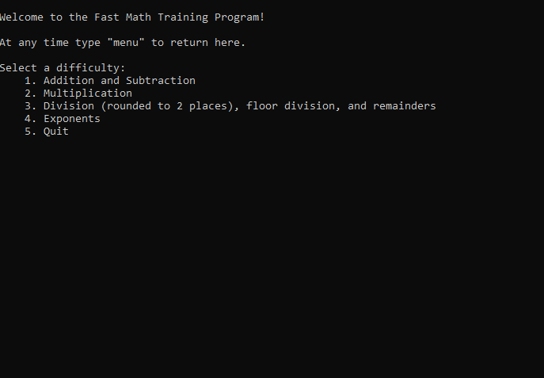

# Math Training Program
The Math Training Program challenges the user to quickly complete arithmetic calculations. I created tihs project my second semester at Florida Gulf Coast University during the COP 1500 Introduction to Computer Science course. Through this project I honed my skills programming in Python. This program was created to both complete our final integration project as well as be used to help my little brothers learn math.
# Demonstration

# Getting Started
1. Install the latest version of Python: https://www.python.org/downloads/.
2. Download main.py from this project.
3. Either double click to run in CMD, or run in your IDE of choice.
# Built With
Built in PyCharm 2020.3.2: https://www.jetbrains.com/pycharm/.
Link to course website: https://sites.google.com/site/profvanselow/course/cop-1500?authuser=0.
Other resources: https://www.w3schools.com/python/ and https://docs.python.org/3/.
# Author
Jonathan Bryan
# Acknowledgments
Professor Vanselow gave feedback multiple times throughout the course and looked over project.
TA Rachel Matthews looked over code soon before final submission.
# Key Programming Concepts Utilized
Program was created according to project criteria: https://sites.google.com/site/profvanselow/course/cop-1500/integration-project.
